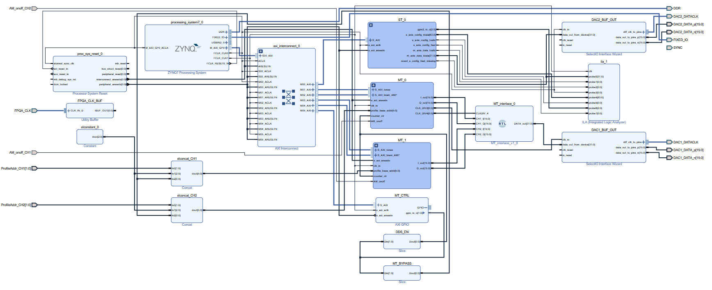
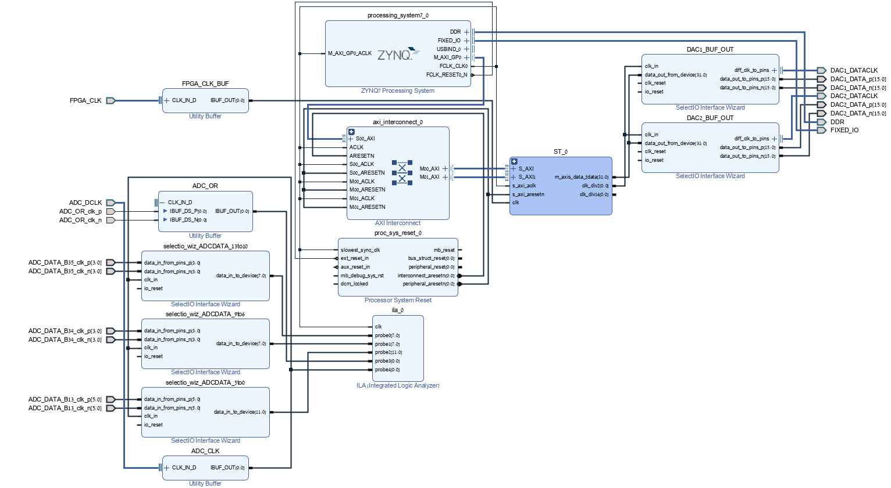

# FPGAPlatformController

This repository contains the FPGA firmware, build scripts, hardware exports, and software for a multi-tone DDS signal generation platform based on the Avnet MicroZed (Xilinx Zynq-7020).

---

## Repository Structure

```
FPGAPlatformController/
├── PYNQ_code/             Python/PYNQ software for controlling the platform
├── projectHW_wMT_build/   Vivado build script — Multi-Tone (MT) design
├── projectHW_ADC_build/   Vivado build script — ADC input design
├── xsa/                   Exported hardware (.xsa) for PYNQ overlay loading
└── docs/                  Block design schematics (PDF)
```

---

## Block Design Documentation

### Multi-Tone (MT) Design
Block diagram of the **Multi-Tone (MT)** design. This variant uses external control signals (`ProfileAddr`, `AM_onoff`) driven from an Arduino via the P1 connector to select frequency profiles and gate the output. The ADC is put in sleep mode in this configuration, freeing the shared pins for external control.



### ADC Input Design
Block diagram of the **ADC input** design. This variant uses the same P1 connector pins as LVDS_25 ADC data inputs. The `adc_capture` module replaces the SelectIO wizard to support DDR capture across multiple I/O banks (Banks 13, 34, 35) using a BUFG-driven global clock.



---

## Building the Vivado Projects

Both designs target the **Avnet MicroZed with Zynq xc7z020clg400-1** and require **Vivado 2021.1**.

### Multi-Tone design
```
cd projectHW_wMT_build
build.bat
```

### ADC input design
```
cd projectHW_ADC_build
build.bat
```

After the script completes, open `projectHW/projectHW.xpr` in Vivado and click **Generate Bitstream**.

---

## PYNQ Software

See [`PYNQ_code/README.md`](PYNQ_code/README.md) for board setup and software usage instructions.

---

## Hardware Exports

The `xsa/` folder contains the exported hardware description files for use with the PYNQ framework:
- `projectHW_wMT.xsa` — Multi-Tone design
- `projectHW_wADC.xsa` — ADC input design
